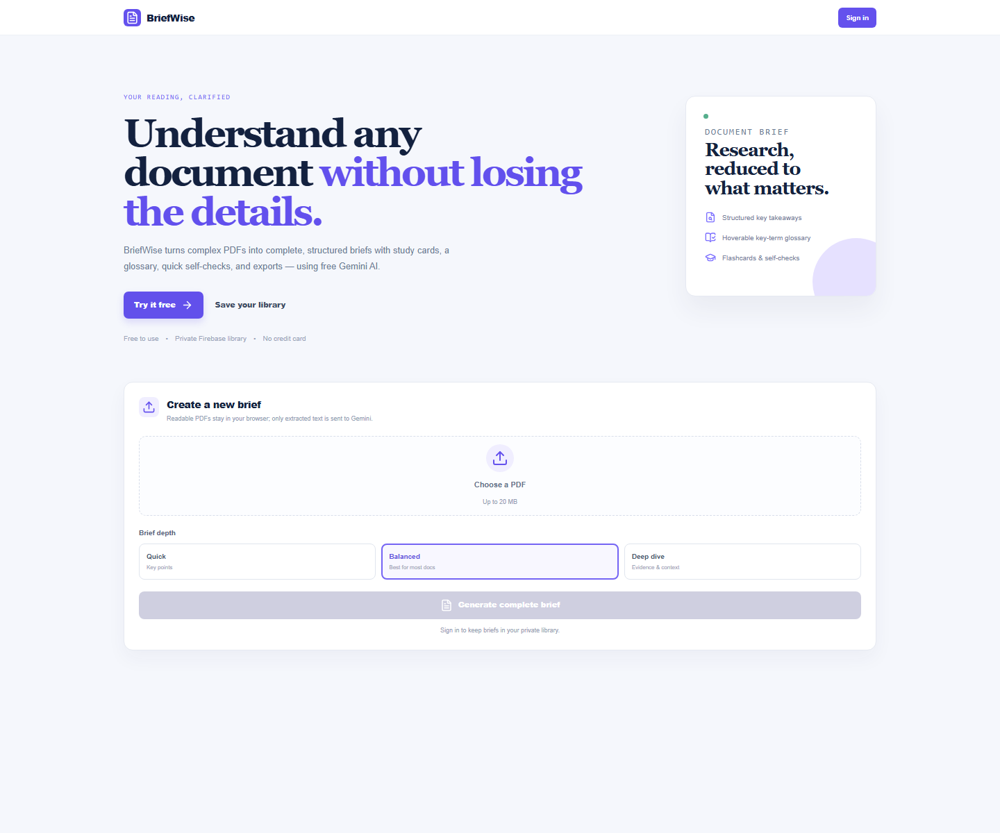

# BriefWise AI

BriefWise AI turns readable PDF documents into clear, structured study briefs. Upload a PDF, choose the depth of the brief, and use the resulting workspace to review key ideas, study terms, test recall, inspect dates, take notes, and ask follow-up questions grounded in the generated brief.

## Preview

<p align="center">
  
</p>

Upload a readable PDF, select the brief depth, and generate a structured document brief. Sign in to save briefs to a private library and continue learning from them later.

## Features

- Extracts text from readable PDFs locally in the browser with PDF.js.
- Generates complete Markdown briefs with Gemini: overview, takeaways, important details, implications, and a key-term section.
- Handles longer documents by creating factual notes per chunk before producing the final brief.
- Offers three output depths: **Quick**, **Balanced**, and **Deep dive**.
- Provides full-text search inside a brief and a hover/focus glossary derived from key terms.
- Includes study flashcards, recall prompts, and a timeline for detected dates.
- Lets users copy a brief or download it as `.md` or `.txt`.
- Includes a brief-grounded tutor that answers only from the generated summary.
- Supports email/password and Google sign-in through Firebase Authentication.
- Saves signed-in users' briefs, bookmarks, and notes to their private Firestore library.

## Tech stack

| Area | Technology |
| --- | --- |
| Front end | React 18, Vite, React Router |
| Styling | Tailwind CSS and custom CSS |
| PDF text extraction | PDF.js (`pdfjs-dist`) |
| AI | Google Gemini Generative Language API |
| Authentication and storage | Firebase Authentication and Cloud Firestore |
| Markdown rendering | `react-markdown` with `remark-gfm` |
| Icons | Lucide React |

## Getting started

### Prerequisites

- Node.js 18 or later
- A Firebase project with **Authentication** and **Cloud Firestore** enabled
- A Gemini API key with access to the configured model

### Install and run

```bash
npm install
copy .env.example .env
npm run dev
```

Open the local URL printed by Vite (normally `http://localhost:5173`).

On macOS or Linux, copy the environment template with:

```bash
cp .env.example .env
```

## Configuration

Set these values in `.env`. Do not commit that file or expose your keys.

```env
VITE_FIREBASE_API_KEY=
VITE_FIREBASE_AUTH_DOMAIN=
VITE_FIREBASE_PROJECT_ID=
VITE_FIREBASE_STORAGE_BUCKET=
VITE_FIREBASE_MESSAGING_SENDER_ID=
VITE_FIREBASE_APP_ID=

VITE_GEMINI_API_KEY=
VITE_GEMINI_MODEL=gemini-3.5-flash

VITE_USE_EMULATORS=false
```

### Firebase setup

1. Create a Firebase web app and copy its configuration values into `.env`.
2. In Firebase Authentication, enable **Email/Password** and **Google** providers if you want both sign-in methods available.
3. Create a Cloud Firestore database.
4. Deploy the included [Firestore rules](./firestore.rules) so users can access only summaries that belong to them.

For local Firebase development, set `VITE_USE_EMULATORS=true` and run Authentication on port `9099` and Firestore on port `8080`.

### Gemini setup

Add a Gemini API key to `VITE_GEMINI_API_KEY`. The app calls the Generative Language API from the browser. Ensure the selected `VITE_GEMINI_MODEL` is available to your key; change the default value when your Gemini project uses a different supported model.

## How it works

1. Select a text-based PDF up to **20 MB**.
2. PDF.js reads every page in the browser. Scanned image-only PDFs will not work because they have no readable text layer.
3. The extracted text is sent to Gemini. Files themselves are not uploaded by the app; the extracted text is what is sent for summarization.
4. Gemini creates the brief. For long documents, BriefWise first summarizes source chunks into factual notes and then creates one final brief.
5. If signed in, the finished brief is stored in Firestore and appears in the private library.

## Project structure

```text
src/
|-- components/       # Upload flow, learning workspace, library, navigation
|-- pages/            # Home, login, and authenticated dashboard pages
|-- lib/
|   |-- gemini.js     # Gemini requests, chunking, and tutor prompt
|   |-- pdfText.js    # Browser-side PDF text extraction
|   |-- firebase.js   # Firebase initialization and emulator support
|   |-- summaries.js  # Firestore CRUD for saved briefs
|   `-- learning.js   # Glossary, reading stats, and timeline helpers
|-- App.jsx           # Routes and providers
`-- index.css         # Application styles
```

## Available scripts

| Command | Description |
| --- | --- |
| `npm run dev` | Start the Vite development server. |
| `npm run build` | Create a production build in `dist/`. |
| `npm run preview` | Serve the production build locally. |

## Privacy and limitations

- BriefWise accepts only PDF files and enforces a 20 MB limit.
- It requires a text-based, readable PDF; OCR is not included for scanned documents.
- PDF text is extracted in the browser. Gemini receives extracted text, not the original PDF file.
- Saved briefs, bookmarks, and notes require sign-in and are stored in Firestore under the authenticated user's account.
- AI summaries and tutor answers should be reviewed against the source document, especially for high-stakes decisions.

## Build for production

```bash
npm run build
npm run preview
```

Deploy the contents of `dist/` to any static hosting provider, ensuring the environment variables are configured for the build process.
